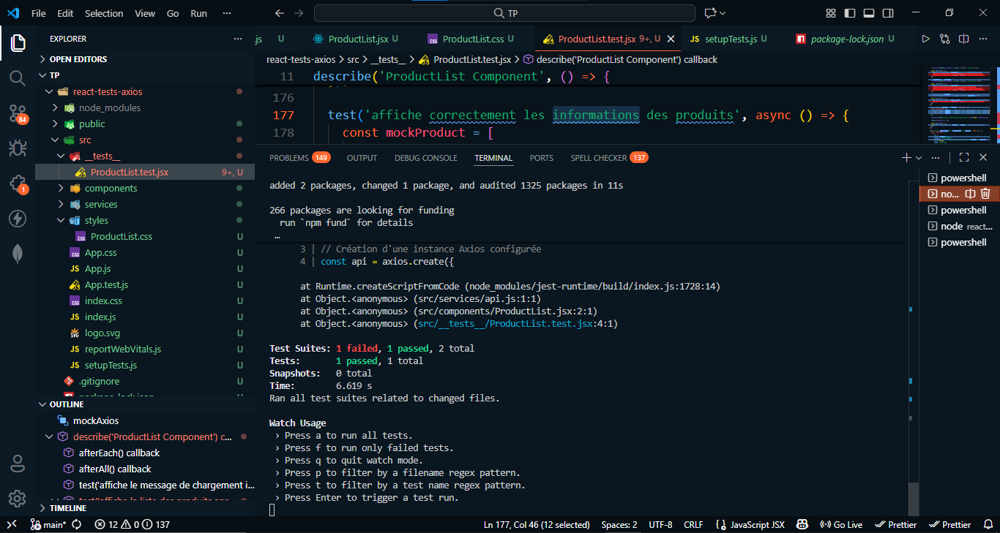

  

# ⚛️ React Tests avec Axios

  

    
Application React avec des tests unitaires utilisant Axios pour les appels API.
    
 ---
    
 ## 🚀 Installation
    
    bash
    npm install
    npm start
  

* * *

🧪 Tests
--------

    npm test
    

* * *

✨ Fonctionnalités
-----------------

*   Liste de produits avec recherche
    
*   Appels API avec Axios
    
*   Tests unitaires complets
    
*   Gestion des erreurs
    

* * *

🌐 API Utilisée
---------------

**Fake Store API**  
[https://fakestoreapi.com](https://fakestoreapi.com/)

* * *

👤 Auteur
---------

**Ayoub Aguezar**

  

